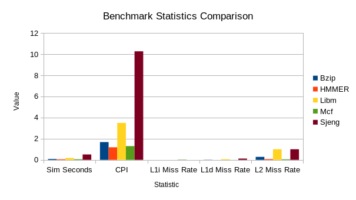
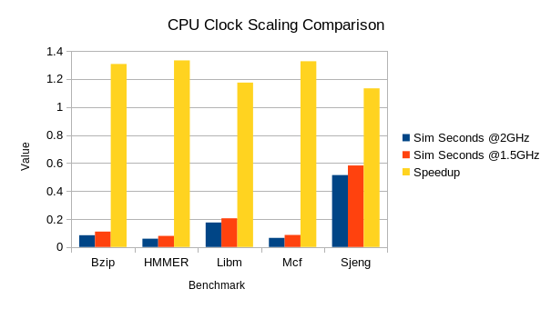

# 2η Εργασία Αρχιτεκτονικής Προηγμένων Υπολογιστών
_του Βασιλείου Μπεσλεμέ και του Διονυσίου Δανιήλ Πλέσσα_ 
[vampesle@ece.auth.gr](mailto:vampesle@ece.auth.gr), [dplessas@ece.auth.gr](mailto:dplessas@ece.auth.gr) 
9862, 9768

## Βήμα 1ο

### 1.

Παρακάτω παρατίθενται τα ζητούμενα στατιστικά από το αρχείο "stats.txt" της κάθε προσομοίωσης:

* **Bzip**
  * `system.cpu.committedInsts`: 100000001
  * `system.cpu.discardedOps`: 190645
  * `system.cpu.dcache.replacements`: 710569
  * `system.l2.overall_accesses::total`: 712341
  * `system.cpu.icache.overall_mshr_misses::total`: 747
  * `system.cpu.dcache.overall_mshr_misses::total`: 711594
* **HMMER**
  * `system.cpu.committedInsts`: 100000000
  * `system.cpu.discardedOps`: 974536
  * `system.cpu.dcache.replacements`: 65718
  * `system.l2.overall_accesses::total`: 70563
  * `system.cpu.icache.overall_mshr_misses::total`: 3821
  * `system.cpu.dcache.overall_mshr_misses::total`: 66741
* **Libm**
  * `system.cpu.committedInsts`: 100000000
  * `system.cpu.discardedOps`: 2680
  * `system.cpu.dcache.replacements`: 1486955
  * `system.l2.overall_accesses::total`: 1488538
  * `system.cpu.icache.overall_mshr_misses::total`: 558
  * `system.cpu.dcache.overall_mshr_misses::total`: 1487980
* **Mcf**
  * `system.cpu.committedInsts`: 100000001
  * `system.cpu.discardedOps`: 690949
  * `system.cpu.dcache.replacements`: 54452
  * `system.l2.overall_accesses::total`: 724390
  * `system.cpu.icache.overall_mshr_misses::total`: 668914
  * `system.cpu.dcache.overall_mshr_misses::total`: 55476
* **Sjeng**
  * `system.cpu.committedInsts`: 100000000
  * `system.cpu.discardedOps`: 4279
  * `system.cpu.dcache.replacements`: 54452
  * `system.l2.overall_accesses::total`: 5264051
  * `system.cpu.icache.overall_mshr_misses::total`: 649
  * `system.cpu.dcache.overall_mshr_misses::total`: 5263402

#### a.
Ο συνολικός αριθμός των commited instructions του κάθε benchmark, δηλώνεται από το στατιστικό "system.cpu.committedInsts". Ο αριθμός αυτός διαφέρει από τον αριθμό των εντολών που εκτελέστηκαν συνολικά, λόγω των εσφαλμένων προβλέψεων διακλάδωσης κατά τη διάρκεια της εκτέλεσης. Δυστυχώς στα αρχεία "stats.txt" δε βρέθηκε κάποιο στατιστικό που να εκφράζει τον συνολικό αριθμό εντολών (commited και μη) και αντ' αυτού συμπεριλαμβάνεται το "system.cpu.discardedOps", το οποίο εκφράζει των αριθμό των operations (μία εντολή μπορεί να αποτελείται από πολλά operations) που δεν έγιναν commit.

#### b.
Τις αντικαταστάσεις block της L1 data cache απαριθμεί το στατιστικό "system.cpu.dcache.replacements".

#### c.
Ο αριθμός των προσπελάσεων της L2 δίνεται από το "system.l2.overall_accesses::total". Σε περίπτωση που αυτό δεν ήταν διαθέσιμο, θα μπορούσαμε να εξάγουμε το παραπάνω δεδομένο προσθέτοντας τα "system.cpu.icache.overall_mshr_misses::total" και "system.cpu.dcache.overall_mshr_misses::total", δηλαδή τις αστοχίες των μνημών L1d και L1i. Το "mshr" σημαίνει "Miss Status Holding Register" και είναι ένας καταχωρητής που αποθηκεύει προσωρινά τις αστοχίες μιας non-blocking cache που δεν έχουν διευθετηθεί.

### 2.
Ακολουθούν τα ζητούμενα στατιστικά από το κάθε benchmark:

* **Bzip**
  1. `sim_seconds`: 0.083982
  2. `system.cpu.cpi`: 1.679650
  3. Miss rates:
    1. `system.cpu.icache.overall_miss_rate::total`: 0.000077
	2. `system.cpu.dcache.overall_miss_rate::total`: 0.014798
	3. `system.l2.overall_miss_rate::total`: 0.282163
* **HMMER**
  1. `sim_seconds`: 0.059396
  2. `system.cpu.cpi`: 1.187917
  3. Miss rates:
    1. `system.cpu.icache.overall_miss_rate::total`: 0.000221
	2. `system.cpu.dcache.overall_miss_rate::total`: 0.001637
	3. `system.l2.overall_miss_rate::total`: 0.077760
* **Libm**
  1. `sim_seconds`: 0.174671
  2. `system.cpu.cpi`: 3.493415
  3. Miss rates:
    1. `system.cpu.icache.overall_miss_rate::total`: 0.000094
	2. `system.cpu.dcache.overall_miss_rate::total`: 0.060972
	3. `system.l2.overall_miss_rate::total`: 0.999944
* **Mcf**
  1. `sim_seconds`: 0.064955
  2. `system.cpu.cpi`: 1.299095
  3. Miss rates:
    1. `system.cpu.icache.overall_miss_rate::total`: 0.023612
	2. `system.cpu.dcache.overall_miss_rate::total`: 0.002108
	3. `system.l2.overall_miss_rate::total`:  0.055046
* **Sjeng**
  1. `sim_seconds`: 0.513528
  2. `system.cpu.cpi`: 10.270554
  3. Miss rates:
    1. `system.cpu.icache.overall_miss_rate::total`: 0.000020
	2. `system.cpu.dcache.overall_miss_rate::total`: 0.121831
	3. `system.l2.overall_miss_rate::total`: 0.999972

Στο παρακάτω διάγραμμα παρουσιάζονται όλα τα παραπάνω δεδομένα ανά benchmark. Παρατηρούμε ότι ο χρόνος εκτέλεσης είναι σχεδόν ανάλογος του CPI, ενώ το L1d miss rate επηρεάζει αρκετά το CPΙ. Έτσι, το "Sjeng" που έχει το μεγαλύτερο CPI, έχει και το υψηλότερο L1d miss rate. Τέλος, τα benchmarks Sjeng και Libm έχουν L2 miss rate σχεδόν ίσο με 1, το οποίο σημαίνει ότι δεν επωφελήθηκαν ιδιαίτερα από την ύπαρξη μνήμης cache L2.

### 3.
Από τα αρχεία "stats.txt" των δύο εκτελέσεων με διαφορετική συχνότητα ρολογιού, το στατιστικό "system.cpu_clk_domain.clock" εκφράζει την περίοδο του ρολογιού του επεξεργαστή σε ticks (picoseconds) και άρα στην περίπτωση των 2GHz είναι 500, ενώ σε αυτή των 1.5GHz είναι 667. Ωστόσο, το στατιστικό "system.clk_domain.clock" είναι ίσο με 1000 και στις δύο περιπτώσεις (και μάλιστα έχει την ίδια περιγραφή "Clock period in ticks" με το προηγούμενο), ενώ το "cpu_cluster.clk_domain.clock" δε βρέθηκε στα αρχεία "stats.txt".

Ανατρέχοντας στο αρχείο "config.json" της δεύτερης προσομοίωσης, παρατηρούμε ότι αρκετά στοιχεία του επεξεργαστή και συγκεκριμένα οι μνήμες cache L1i, L1d, L2 καθώς και οι TLBi, TLBd ("itb", "dtb") έχουν ως ρολόι το "system.cpu_clk_domain" και άρα ίδιο με το ρολόι του επεξεργαστή 1.5GHz), ενώ για παράδειγμα το bus της μνήμης RAM ("membus") λειτουργεί στη συχνότητα του "system.clk_domain" (1GHz).

Και πάλι με βάση το αρχείο "config.json", παρατηρώντας την τιμή της καταχώρισης "system/cpu_clk_domain/clock/0", η οποία είναι ίση με 667, και της "system/cpu_clk_domain/path", που είναι ίση με "system.cpu_clk_domain", συμπεραίνουμε ότι ο κάθε επεξεργαστής (των οποίων η αρίθμηση ξεκινά συνήθως από το 0) κληρονομεί τη συχνότητα ρολογιού του από την τιμή της παραμέτρου "system.cpu_clk_domain", δηλαδή 667 στην περίπτωση των 1.5GHz. Επομένως, περιμένουμε ότι αυτή θα είναι και η συχνότητα επιπλέον επεξεργαστών που θα μπορούσαμε να προσθέσουμε.

Ο χρόνος εκτέλεσης των benchmarks στις δύο διαφορετικές συχνότητες φαίνεται στο παρακάτω διάγραμμα. Παρατηρούμε ότι το speedup είναι αρκετά κοντά στην τιμή 2/1.5 (~1.33). Ωστόσο, ιδιαίτερα στις περιπτώσεις των Libm και Sjeng που έχουν τα μεγαλύτερα cache miss rates, οι τιμές αποκλίνουν περισσότερο, καθώς η αύξηση της συχνότητας του ρολογιού της CPU δε βελτιώνει το miss penalty των μνημών cache.

