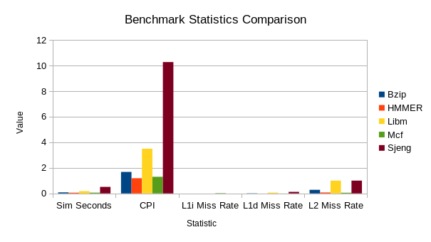
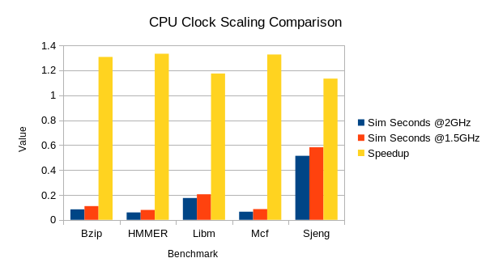
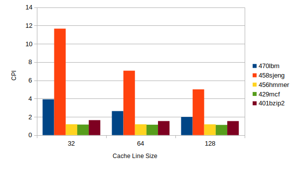
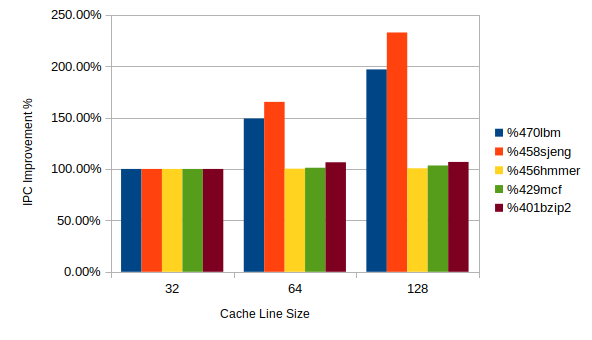
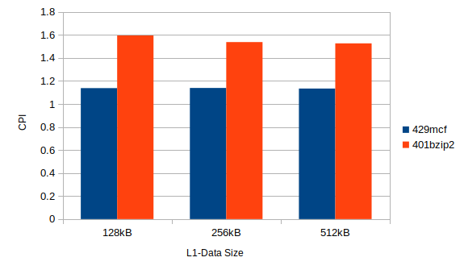
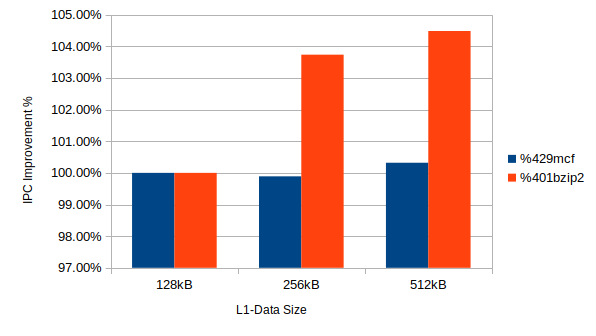
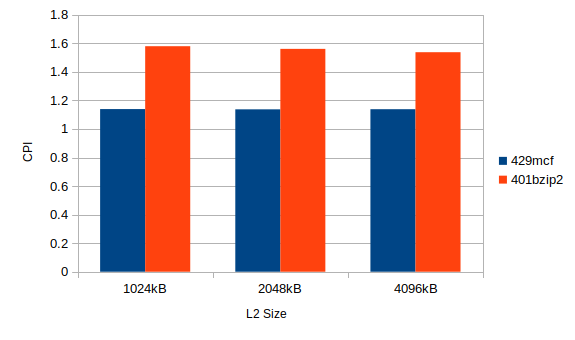
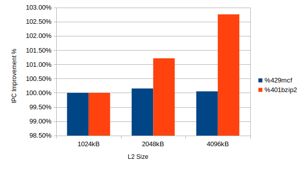
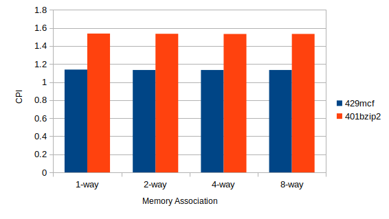
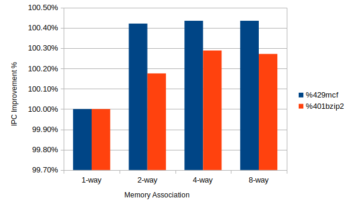

# 2η Εργασία Αρχιτεκτονικής Προηγμένων Υπολογιστών
_του Βασιλείου Μπεσλεμέ και του Διονυσίου Δανιήλ Πλέσσα_ 
[vampesle@ece.auth.gr](mailto:vampesle@ece.auth.gr), [dplessas@ece.auth.gr](mailto:dplessas@ece.auth.gr) 
9862, 9768

-------------------------------------------

## Βήμα 1ο

### 1.

Παρακάτω παρατίθενται τα ζητούμενα στατιστικά από το αρχείο "stats.txt" της κάθε προσομοίωσης:

* **Bzip2**
  * `system.cpu.committedInsts`: 100000001
  * `system.cpu.discardedOps`: 190645
  * `system.cpu.dcache.replacements`: 710569
  * `system.l2.overall_accesses::total`: 712341
  * `system.cpu.icache.overall_mshr_misses::total`: 747
  * `system.cpu.dcache.overall_mshr_misses::total`: 711594
* **HMMER**
  * `system.cpu.committedInsts`: 100000000
  * `system.cpu.discardedOps`: 974536
  * `system.cpu.dcache.replacements`: 65718
  * `system.l2.overall_accesses::total`: 70563
  * `system.cpu.icache.overall_mshr_misses::total`: 3821
  * `system.cpu.dcache.overall_mshr_misses::total`: 66741
* **Libm**
  * `system.cpu.committedInsts`: 100000000
  * `system.cpu.discardedOps`: 2680
  * `system.cpu.dcache.replacements`: 1486955
  * `system.l2.overall_accesses::total`: 1488538
  * `system.cpu.icache.overall_mshr_misses::total`: 558
  * `system.cpu.dcache.overall_mshr_misses::total`: 1487980
* **Mcf**
  * `system.cpu.committedInsts`: 100000001
  * `system.cpu.discardedOps`: 690949
  * `system.cpu.dcache.replacements`: 54452
  * `system.l2.overall_accesses::total`: 724390
  * `system.cpu.icache.overall_mshr_misses::total`: 668914
  * `system.cpu.dcache.overall_mshr_misses::total`: 55476
* **Sjeng**
  * `system.cpu.committedInsts`: 100000000
  * `system.cpu.discardedOps`: 4279
  * `system.cpu.dcache.replacements`: 54452
  * `system.l2.overall_accesses::total`: 5264051
  * `system.cpu.icache.overall_mshr_misses::total`: 649
  * `system.cpu.dcache.overall_mshr_misses::total`: 5263402

#### a.
Ο συνολικός αριθμός των commited instructions του κάθε benchmark, δηλώνεται από το στατιστικό "system.cpu.committedInsts". Ο αριθμός αυτός διαφέρει από τον αριθμό των εντολών που εκτελέστηκαν συνολικά, λόγω των εσφαλμένων προβλέψεων διακλάδωσης κατά τη διάρκεια της εκτέλεσης. Δυστυχώς στα αρχεία "stats.txt" δε βρέθηκε κάποιο στατιστικό που να εκφράζει τον συνολικό αριθμό εντολών (commited και μη) και αντ' αυτού συμπεριλαμβάνεται το "system.cpu.discardedOps", το οποίο εκφράζει των αριθμό των operations (μία εντολή μπορεί να αποτελείται από πολλά operations) που δεν έγιναν commit.

#### b.
Τις αντικαταστάσεις block της L1 data cache απαριθμεί το στατιστικό "system.cpu.dcache.replacements".

#### c.
Ο αριθμός των προσπελάσεων της L2 δίνεται από το "system.l2.overall_accesses::total". Σε περίπτωση που αυτό δεν ήταν διαθέσιμο, θα μπορούσαμε να εξάγουμε το παραπάνω δεδομένο προσθέτοντας τα "system.cpu.icache.overall_mshr_misses::total" και "system.cpu.dcache.overall_mshr_misses::total", δηλαδή τις αστοχίες των μνημών L1d και L1i. Το "mshr" σημαίνει "Miss Status Holding Register" και είναι ένας καταχωρητής που αποθηκεύει προσωρινά τις αστοχίες μιας non-blocking cache που δεν έχουν διευθετηθεί.

### 2.
Ακολουθούν τα ζητούμενα στατιστικά από το κάθε benchmark:

* **Bzip2**
  1. `sim_seconds`: 0.083982
  2. `system.cpu.cpi`: 1.679650
  3. Miss rates:
	1. `system.cpu.icache.overall_miss_rate::total`: 0.000077
	2. `system.cpu.dcache.overall_miss_rate::total`: 0.014798
	3. `system.l2.overall_miss_rate::total`: 0.282163
* **HMMER**
  1. `sim_seconds`: 0.059396
  2. `system.cpu.cpi`: 1.187917
  3. Miss rates:
    1. `system.cpu.icache.overall_miss_rate::total`: 0.000221
	2. `system.cpu.dcache.overall_miss_rate::total`: 0.001637
	3. `system.l2.overall_miss_rate::total`: 0.077760
* **Libm**
  1. `sim_seconds`: 0.174671
  2. `system.cpu.cpi`: 3.493415
  3. Miss rates:
    1. `system.cpu.icache.overall_miss_rate::total`: 0.000094
	2. `system.cpu.dcache.overall_miss_rate::total`: 0.060972
	3. `system.l2.overall_miss_rate::total`: 0.999944
* **Mcf**
  1. `sim_seconds`: 0.064955
  2. `system.cpu.cpi`: 1.299095
  3. Miss rates:
    1. `system.cpu.icache.overall_miss_rate::total`: 0.023612
	2. `system.cpu.dcache.overall_miss_rate::total`: 0.002108
	3. `system.l2.overall_miss_rate::total`:  0.055046
* **Sjeng**
  1. `sim_seconds`: 0.513528
  2. `system.cpu.cpi`: 10.270554
  3. Miss rates:
    1. `system.cpu.icache.overall_miss_rate::total`: 0.000020
	2. `system.cpu.dcache.overall_miss_rate::total`: 0.121831
	3. `system.l2.overall_miss_rate::total`: 0.999972

Στο παρακάτω διάγραμμα παρουσιάζονται όλα τα παραπάνω δεδομένα ανά benchmark. Παρατηρούμε ότι ο χρόνος εκτέλεσης είναι σχεδόν ανάλογος του CPI, ενώ το L1d miss rate επηρεάζει αρκετά το CPΙ. Έτσι, το "Sjeng" που έχει το μεγαλύτερο CPI, έχει και το υψηλότερο L1d miss rate. Τέλος, τα benchmarks Sjeng και Libm έχουν L2 miss rate σχεδόν ίσο με 1, το οποίο σημαίνει ότι δεν επωφελήθηκαν ιδιαίτερα από την ύπαρξη μνήμης cache L2.

### 3.
Από τα αρχεία "stats.txt" των δύο εκτελέσεων με διαφορετική συχνότητα ρολογιού, το στατιστικό "system.cpu_clk_domain.clock" εκφράζει την περίοδο του ρολογιού του επεξεργαστή σε ticks (picoseconds) και άρα στην περίπτωση των 2GHz είναι 500, ενώ σε αυτή των 1.5GHz είναι 667. Ωστόσο, το στατιστικό "system.clk_domain.clock" είναι ίσο με 1000 και στις δύο περιπτώσεις (και μάλιστα έχει την ίδια περιγραφή "Clock period in ticks" με το προηγούμενο), ενώ το "cpu_cluster.clk_domain.clock" δε βρέθηκε στα αρχεία "stats.txt".

Ανατρέχοντας στο αρχείο "config.json" της δεύτερης προσομοίωσης, παρατηρούμε ότι αρκετά στοιχεία του επεξεργαστή και συγκεκριμένα οι μνήμες cache L1i, L1d, L2 καθώς και οι TLBi, TLBd ("itb", "dtb") έχουν ως ρολόι το "system.cpu_clk_domain" και άρα ίδιο με το ρολόι του επεξεργαστή 1.5GHz), ενώ για παράδειγμα το bus της μνήμης RAM ("membus") λειτουργεί στη συχνότητα του "system.clk_domain" (1GHz).

Και πάλι με βάση το αρχείο "config.json", παρατηρώντας την τιμή της καταχώρισης "system/cpu_clk_domain/clock/0", η οποία είναι ίση με 667, και της "system/cpu_clk_domain/path", που είναι ίση με "system.cpu_clk_domain", συμπεραίνουμε ότι ο κάθε επεξεργαστής (των οποίων η αρίθμηση ξεκινά συνήθως από το 0) κληρονομεί τη συχνότητα ρολογιού του από την τιμή της παραμέτρου "system.cpu_clk_domain", δηλαδή 667 στην περίπτωση των 1.5GHz. Επομένως, περιμένουμε ότι αυτή θα είναι και η συχνότητα επιπλέον επεξεργαστών που θα μπορούσαμε να προσθέσουμε.

Ο χρόνος εκτέλεσης των benchmarks στις δύο διαφορετικές συχνότητες φαίνεται στο παρακάτω διάγραμμα. Παρατηρούμε ότι το speedup είναι αρκετά κοντά στην τιμή 2/1.5 (~1.33). Ωστόσο, ιδιαίτερα στις περιπτώσεις των Libm και Sjeng που έχουν τα μεγαλύτερα cache miss rates, οι τιμές αποκλίνουν περισσότερο, καθώς η αύξηση της συχνότητας του ρολογιού της CPU δε βελτιώνει το miss penalty των μνημών cache.

-------------------------------------------

## Βήμα 2ο

### 1.

Οι προσομοιώσεις που εκτελέστηκαν είναι για τα παρακάτω συστήματα μνημών:
|Num.	| Τitle | L1d size (KB) | L1d Assoc. | L1i size (KB) | L1i Assoc. | L2 size	 (KB) | L2 Assoc.  | Cache Line (B) |
| ------ | ----- | --------- | ------------- | --------- |------------- | --------- | ------------- | --------- | 
| **1** | **Control** | 256 | 1 | 256 | 1 | 4096 | 1 | 64 |
| **2** | L1 Alloc. Test | 128 | 1 | 256 | 1 | 4096 | 1 | 64 |
| **3** | L1 Alloc. Test | 256 | 1 | 128 | 1 | 4096 | 1 | 64 |
| **4** | L2 Test | 256 | 1 | 256 | 1 | 2048 | 1 | 64 |
| **5** | L2 Test | 256 | 1 | 256 | 1 | 1024 | 1 | 64 |
| **6** | L1d Test | 512 | 1 | 256 | 1 | 4096 | 1 | 64 |
| **7** | C. Line Test | 256 | 1 | 256 | 1 | 4096 | 1 | 32 |
| **8** | C. Line Test | 256 | 1 | 256 | 1 | 4096 | 1 | 128|
| **9** | Assoc. Test | 256 | 2 | 256 | 2 | 4096 | 2 | 64 |
| **10**| Assoc. Test | 256 | 4 | 256 | 2 | 4096 | 4 | 64 |
| **11**| Assoc. Test | 256 | 8 | 256 | 8 | 4096 | 8 | 64 |
| **12**| Perfect Test | 256 | 4 | 256 | 4 | 4096 | 4 | 128 |
| **13**| Perfect Test | 256 | 4 | 256 | 4 | 4096 | 4 | 256 |

Τα παραπάνω συστήματα δοκιμάστηκαν και τα αποτελέσματα των benchmark καθώς και παρατηρήσεις μπορούν να βρεθούν παρακάτω:

* ### Libm

| Libm | CPI | L1d-M.R. | L1i-M.R. | L2-M.R. | 
| --------- | ---- | -----------| ---------- | --------- |
| **1** | 2.628334 | 0.061119 | 8.4E-05 | 0.996652 | 
| **2** | 2.631172 | 0.061266 | 8.4E-05 | 0.993268 | 
| **3** | 2.628334 | 0.061119 | 8.9E-05 | 0.996635 | 
| **4** | 2.630777 | 0.061118 | 8.5E-05 | 0.996729 | 
| **5** | 2.632625 | 0.061118 | 8.5E-05 | 0.996883 | 
| **6** | 2.627128 | 0.061045 | 8.4E-05 | 0.998356 | 
| **7** | 3.919794 | 0.122000 | 8.1E-05 | 0.999284 | 
| **8** | 1.991476 | 0.030809 | 8.3E-05 | 0.985802 | 
| **9** | 2.620761 | 0.060971 | 8.5E-05 | 0.999982 | 
| **10** | 2.620761 | 0.060971 | 8.5E-05 | 0.999982 | 
| **11** | 2.620761 | 0.060971 | 8.5E-05 | 0.999982 | 
| **12** | 1.989119 | 0.030487 | 8.3E-05 | 0.999961 | 
| **13** | 1.653858 | 0.015244 | 8E-05 | 0.999922 | 

Παρατηρήσεις για τα αποτελέσματα του Libm:
1. Μεγάλες χωρητικότητες στις caches δεν μας δίνουν ιδιαίτερα αποτελέσματα. Συγκεκριμένα η L2 δεν αξιοποιείται σχεδόν καθόλου. Αυτό εξάγεται εύκολα από τα πολύ υψηλά miss rate που οφείλονται στην αρχική φόρτωση των δεδομένων από την μνήμη.
2. Ο συσχετισμός στις μνήμες δίνει σχεδόν μηδενική βελτίωση απόδοσης.
3. Το μέγεθος γραμμής των κρυφών μνημών παίζει σημαντικό ρόλο στη συνολική απόδοση.

-------------------------------------------

* ### Sjeng

| Sjeng | CPI | L1d-M.R. | L1i-M.R. | L2-M.R. | 
| --------- | ---- | -----------| ---------- | --------- |
| **1** | 7.057547 | 0.122365 | 1.9E-05 | 0.991297 | 
| **2** | 7.057546 | 0.122368 | 1.9E-05 | 0.991262 | 
| **3** | 7.057568 | 0.122365 | 1.9E-05 | 0.991296 | 
| **4** | 7.059353 | 0.122365 | 1.9E-05 | 0.991297 | 
| **5** | 7.060121 | 0.122365 | 1.9E-05 | 0.991297 | 
| **6** | 7.038328 | 0.121830 | 1.9E-05 | 0.999988 | 
| **7** | 11.664983 | 0.243921 | 2.2E-05 | 0.997805 | 
| **8** | 5.011064 | 0.061986 | 1.3E-05 | 0.966107 | 
| **9** | 7.0384 | 0.121830 | 1.9E-05 | 0.99999 | 
| **10** | 7.038652 | 0.121830 | 1.9E-05 | 0.999992 | 
| **11** | 7.039063 | 0.121830 | 1.9E-05 | 0.999992 | 
| **12** | 4.972484 | 0.060917 | 1.3E-05 | 0.999985 | 
| **13** | 3.714674 | 0.030461 | 9E-06 | 0.999974 | 

Παρατηρήσεις για τα αποτελέσματα του Sjeng:
1. Μεγάλες χωρητικότητες στις caches δεν μας δίνουν ιδιαίτερα αποτελέσματα. Στην πραγματικότητα μπορούν να μειώσουν την απόδοση ελάχιστα (το #6 εκτελέστικε με χαμηλότερο CPI από το Control #1).
2. Ο συσχετισμός στις μνήμες δίνει σχεδόν μηδενική βελτίωση απόδοσης.
3. Το μέγεθος γραμμής των κρυφών μνημών παίζει σημαντικό ρόλο στη συνολική απόδοση.

-------------------------------------------

* ### HMMER

| HMMER | CPI | L1d-M.R. | L1i-M.R. | L2-M.R. | 
| --------- | ---- | -----------| ---------- | --------- |
| **1** | 1.182639 | 0.000214 | 0.000355 | 0.438528 | 
| **2** | 1.189905 | 0.001458 | 0.000355 | 0.082945 | 
| **3** | 1.182639 | 0.000214 | 0.000365 | 0.432598 | 
| **4** | 1.182627 | 0.000214 | 0.000355 | 0.438617 | 
| **5** | 1.182627 | 0.000214 | 0.000355 | 0.438617 | 
| **6** | 1.182167 | 0.000169 | 0.000355 | 0.516305 | 
| **7** | 1.185982 | 0.000370 | 0.000393 | 0.556754 | 
| **8** | 1.178179 | 0.000131 | 0.000308 | 0.338218 | 
| **9** | 1.181437 | 0.000178 | 7.8E-05 | 0.885843 | 
| **10** | 1.181359 | 0.000166 | 7.8E-05 | 0.963684 | 
| **11** | 1.181346 | 0.000163 | 7.8E-05 | 0.981594 | 
| **12** | 1.177097 | 8.9E-05 | 5.5E-05 | 0.944978 | 
| **13** | 1.175467 | 4.8E-05 | 3.7E-05 | 0.914318 | 

Παρατηρήσεις για τα αποτελέσματα του HMMER:
1. Μεγάλες χωρητικότητες στις L2 και L1i caches δεν μας δίνουν ιδιαίτερα αποτελέσματα. Στην πραγματικότητα μπορούν να μειώσουν την απόδοση ελάχιστα. Εξαίρεση είναι η L1d η οποία αποδίδει πολύ χειρότερα στο #2 όπου χρησιμοποιούμε περισσότερη L1i αντί L1d. Αυτό έχει αντίκτυπο και στο CPI με μία μετρήσιμη αύξηση.
2. Ο συσχετισμός στις μνήμες δίνει σχεδόν μηδενική βελτίωση απόδοσης ενώ μειώνει σημαντικά την χρήση της L2. Αυτό το συμπεραίνουμε εύκολα από τα πολύ υψηλά miss rates που οφείλονται στην αρχική φόρτωση των δεδομένων.
3. Το μέγεθος γραμμής των κρυφών μνημών παίζει μηδαμινό ρόλο στην απόδοση. Ταυτόχρονα, για μεγάλες τιμές έχουμε καλύτερη αξιοποίηση της L2 με χαμηλότερα miss rate.

-------------------------------------------

* ### Mcf

| Mcf | CPI | L1d-M.R. | L1i-M.R. | L2-M.R. | 
| --------- | ---- | -----------| ---------- | --------- |
| **1** | 1.138807 | 0.002090 | 1.8E-05 | 0.710269 | 
| **2** | 1.137562 | 0.002453 | 1.8E-05 | 0.623279 | 
| **3** | 1.135591 | 0.002136 | 1.8E-05 | 0.712367 | 
| **4** | 1.137664 | 0.002136 | 1.8E-05 | 0.764292 | 
| **5** | 1.139401 | 0.002136 | 1.8E-05 | 0.801502 | 
| **6** | 1.133927 | 0.001922 | 1.8E-05 | 0.793807 | 
| **7** | 1.152669 | 0.003197 | 2.6E-05 | 0.829586 | 
| **8** | 1.114983 | 0.001385 | 1.3E-05 | 0.529382 | 
| **9** | 1.134034 | 0.001893 | 1.8E-05 | 0.802532 | 
| **10** | 1.133878 | 0.001859 | 1.8E-05 | 0.814546 | 
| **11** | 1.133878 | 0.001849 | 1.8E-05 | 0.817793 | 
| **12** | 1.112899 | 0.001050 | 1.3E-05 | 0.701029 | 
| **13** | 1.098942 | 0.000644 | 9E-06 | 0.548701 | 

Παρατηρήσεις για τα αποτελέσματα του Mcf:
1. Αύξηση στην χωρητικότητα της L2, από 1MB σε 2MB μπορεί να επιφέρει μικρή βελτίωση του CPI. Κατανέμοντας περισσότερη από την L1 για χρήση data μπορούμε να βελτιώσουμε τις επιδώσεις.
2. Ο συσχετισμός στις μνήμες μπορεί να βελτιώσει τις επιδόσεις. Μηδαμινά αποτελέσματα μετά από 4-way set associative.
3. Η αύξηση του μήκους γραμμής των μνημών μπορεί να μας δώσει ικανοποιητικές βελτιώσεις (βλ. #7, #1, #8)

-------------------------------------------

* ### Bzip2

| Bzip2 | CPI | L1d-M.R. | L1i-M.R. | L2-M.R. | 
| --------- | ---- | -----------| ---------- | --------- |
| **1** | 1.537472 | 0.008766 | 7E-05 | 0.453703 | 
| **2** | 1.594889 | 0.014053 | 7E-05 | 0.270552 | 
| **3** | 1.537480 | 0.008767 | 7.2E-05 | 0.453694 | 
| **4** | 1.560921 | 0.008761 | 7E-05 | 0.538613 | 
| **5** | 1.579862 | 0.008749 | 7E-05 | 0.619829 | 
| **6** | 1.526448 | 0.007240 | 7E-05 | 0.563240 | 
| **7** | 1.638202 | 0.012731 | 8.3E-05 | 0.592935 | 
| **8** | 1.533115 | 0.007662 | 5.2E-05 | 0.309546 | 
| **9** | 1.534778 | 0.008223 | 7E-05 | 0.477444 | 
| **10** | 1.533048 | 0.008016 | 7E-05 | 0.490181 | 
| **11** | 1.533309 | 0.008014 | 7E-05 | 0.490412 | 
| **12** | 1.526921 | 0.006566 | 5.2E-05 | 0.356087 | 
| **13** | 1.517982 | 0.006357 | 3.9E-05 | 0.240074 | 

Παρατηρήσεις για τα αποτελέσματα του Bzip2:
1. Αύξηση στην χωρητικότητα της L2, από 1MΒ σε 2MΒ μπορεί να επιφέρει μικρή βελτίωση του CPI. Κατανέμοντας περισσότερη από την L1 για χρήση data μπορούμε να βελτιώσουμε τις επιδώσεις.
2. Ο συσχετισμός στις μνήμες μπορεί να βελτιώσει ελάχιστα τις επιδόσεις. Μηδαμινά αποτελέσματα μετά από 2-way set associative.
3. Η αύξηση του μήκους γραμμής των μνημών μπορεί να μας δώσει ικανοποιητικές βελτιώσεις.

### 2.

Αφού μερικοί παράγοντες είχαν σχεδόν μηδενική επίδραση σε συγκεκριμένα benchmark, τα αποτελέσματά της μεταβολής τους δεν συμπεριλήφθηκαν στο αντίστοιχο γράφημα.

-------------------------------------------

## Βήμα 3ο

Αρχικά, ως μέγεθος το οποίο εκφράζει το "κόστος" των caches της CPU που χρησιμοποιήθηκαν, επιλέχθηκε το ποσοστό του εμβαδού που αυτές καταλαμβάνουν στο _die_ ενός πυρήνα ανά KB. Με αυτόν τον τρόπο εκφράζεται έμμεσα και το κόστος κατασκευής της κάθε μνήμης. Πιο συγκεκριμένα, ως οδηγός χρησιμοποιήθηκε [μια εικόνα του die του επεξεργαστή _Intel Nehalem_](https://en.wikichip.org/w/images/b/b7/intel_nehalem_lynfield_die_shot.jpg), για τον οποίο βρέθηκε ποιο τμήμα του die αντιστοιχεί στις μνήμες cache (μέσω [αυτής της εικόνας](https://1.bp.blogspot.com/-X2nmR1lGAeo/VHO1OWGLvyI/AAAAAAAAQRA/ViSFgu66IQg/s1600/IMG0024255.jpg)). Καθότι ο συγκεκριμένος επεξεργαστής είναι πολυπύρηνος, τα ποσοστά υπολογίστηκαν ως προς το εμβαδόν ενός πυρήνα. Στη συνέχεια, τα ποσοστά αυτά διαιρέθηκαν με την χωρητικότητα της αντίστοιχης μνήμης cache. Τα αποτελέσματα παρατίθενται στον παρακάτω πίνακα.

|     | Cache Die Percentage | Cache Cost x 100 (/KB) |
| --- | -------------------- | --------------- |
| L1i | 2.15%                | 6.72            |
| L1d | 2.15%                | 6.72            |
| L2  | 8.08%                | 3.16            |

 

<i>
*Να σημειωθεί ότι η παραπάνω CPU διαθέτει και μνήμη cache L3, η οποία όμως είναι κοινή για όλα τα cores και άρα δεν προσμετρήθηκε στο εμβαδόν που καταλαμβάνει το κάθε core.
</i>

Παρατηρούμε ότι η L2 έχει χαμηλότερο κόστος (αν και είναι μεγαλύτερης χωρητικότητας) από την L1, όπως ήταν και αναμενόμενο, αφού είναι απλούστερη να κατασκευαστεί και πιο πυκνή από άποψη χωρητικότητας.

Δυστυχώς, για τις υπόλοιπες παραμέτρους που μελετήθηκαν στο 2ο βήμα (cache line size και associativity), δε βρέθηκαν ποσοτικά στοιχεία στη βιβλιογραφία ή το διαδίκτυο ικανά να συμβάλλουν στη διαμόρφωση της συνάρτησης κόστους. Παρ' όλα αυτά, το associativity των μνημών δε διαδραμάτισε σημαντικό ρόλο στην απόδοση του επεξεργαστή και άρα θα μπορούσε να παραληφθεί από τη συνάρτηση.

Τελικώς, καταλήγουμε στην παρακάτω συνάρτηση κόστους: 
`Cost(L1_Size, L2_Size) = 6.72 * L1_Size + 3.16 L2_Size`

Με βάση αυτή, υπολογίζοντας το λόγο του IPC προς το κόστος για κάθε συνδυασμό μνημών cache που προσομοιώθηκε στο προηγούμενο βήμα, έχουμε:

|Num.	| L1d size (KB) |  L1i size (KB) |  L2 size (KB) |  Cost(L1_Size,L2_Size) |  IPC/Cost Bzip2 | IPC/Cost Hmmer | IPC/Cost Libm | IPC/Cost Mcf | IPC/Cost Sjeng | IPC/Cost Average |
| ----- | ------------- | -------------- | ------------- | ----------------------- | --------------- | -------------- | ------------- | ------------ | -------------- |----------------- |
| **1** | 256 | 256 | 4096 | 16384 | 3.97E-05 | 5.16E-05 | 2.23E-05 | 5.36E-05 | 8.65E-06 | 3.52E-05 |
| **2** | 128 | 256 | 4096 | 15524 | 4.04E-05 | 5.41E-05 | 2.45E-05 | 5.66E-05 | 9.13E-06 | 3.69E-05 |
| **3** | 256 | 128 | 4096 | 15524 | 4.19E-05 | 5.45E-05 | 2.45E-05 | 5.67E-05 | 9.13E-06 | 3.73E-05 |
| **4** | 256 | 256 | 2048 | 9912 | 6.46E-05 | 8.53E-05 | 3.83E-05 | 8.87E-05 | 1.43E-05 | 5.82E-05 |
| **5** | 256 | 256 | 1024 | 6676 | 9.48E-05 | 1.27E-04 | 5.69E-05 | 1.31E-04 | 2.12E-05 | 8.62E-05 |

Αλλάζουμε τις επιλογές που κάναμε στα μεγέθη των μνημών καθώς ήταν υπερβολικά μεγάλες (μεγάλο κόστος) για μηδαμινές βελτιώσεις (diminishing returns).
Ως ιδανικό θεωρήθεικε το σύστημα μνημών με τα παρακάτω:

|Num.	| L1d size (KB) | L1d Assoc. |  L1i size (KB) | L1i Assoc. |  L2 size (KB) | L2 Assoc. | Cache Line Size |  CPI Bzip2 | CPI Hmmer | CPI Libm | CPI Mcf | CPI Sjeng | CPI Average |
| ----- | ------------- | ---------- | -------------- | ---------- | ------------- | --------- | --------------- | ---------- | --------- | -------- | ------- | --------- | ----------- |
| **Ideal Estimate** | 64 | 4 | 64 | 4 | 1024 | 4 | 256 | 1,604 | 1,177 | 1,655 | 1,103 | 3,716 | 1.851 |
| **13 (Maximum Performing)** | 256 | 4 | 256 | 4 | 4096 | 4 | 256 | 1.518 | 1,175 | 1,654 | 1,110 | 3,715 | 1.834 |

Άρα έχουμε μία μέση μείωση 0.9% στις επιδώσεις του επεξεργαστή (βάση των CPI αποτελεσμάτων) πηγαίνοντας από το μοντέλο μέγιστων επιδόσεων στο βασισμένο στο ελάχιστο κόστος μοντέλο.

|Num.	| L1d size (KB) | L1i size (KB) | L2 size (KB) | Cost(L1_Size,L2_Size) |  IPC/Cost Bzip2 | IPC/Cost Hmmer | IPC/Cost Libm | IPC/Cost Mcf | IPC/Cost Sjeng | IPC/Cost Average |
| ----- | ------------- | ------------- | ------------ | --------------------- | --------------- | -------------- | ------------- | ------------ | -------------- |--------------------- |
| **Ideal Estimate** | 64 | 64 | 1024 | 4096 | 1.52E-04 | 2.07E-04 | 1.47E-04 | 2.21E-04 | 6.57E-05 | 1.59E-04 |

 

